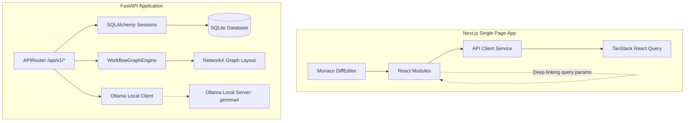

# Catalyst Codebase Documentation & Architecture Guide

Welcome to the **Catalyst** developer reference guide. This document serves as a comprehensive system walkthrough designed to explain the architecture, API integrations, and features to mentors or project reviews.

---

## 1. System Overview & Architecture

Catalyst is a workflow intelligence platform designed to analyze, map, and run regression tests on Oracle OTM (Transportation Management) and GTM (Global Trade Management) configurations. It surfaces execution overlaps (conflicts) between classic rules and Oracle AI agents in real-time.

### Architectural Blueprint



---

## 2. Core Database Schema & Models
Data is ingested from standard OTM/GTM XML configurations (seeded via the `NWL-26B` Northwind Logistics fixture set) into SQLite.

| Model / Table | Key Attributes | Purpose |
| :--- | :--- | :--- |
| `Agent` | `agent_gid`, `agent_name`, `definition` (XML) | Represents classic legacy OTM rule pathways. |
| `AiAgent` | `agent_gid`, `visibility` (full/limited), `trigger_event` | Represents AI models and recovery estimators. |
| `AgentEvent` | `agent_gid`, `event_name`, `saved_condition_query_gid` | Maps agent triggers to transactional database condition queries. |
| `Conflict` | `conflict_id`, `severity`, `trigger_event`, `affected_agents` | Records overlapping trigger events identified by the conflict engine. |
| `SavedQuery` | `query_gid`, `sql_text` | Records query constraints used by classic rule engines. |

---

## 3. Backend REST API Core (`/api/v1/*`)

Every frontend module is wired directly to FastAPI. The main endpoints include:

*   **`GET /api/v1/health`**: Returns system service status, environment, and connector health metrics.
*   **`GET /api/v1/dashboard`**: Synthesizes card telemetry (active agents count, loaded fixture bundles, domain totals).
*   **`GET /api/v1/graph`**: Builds nodes, edges, and domain dependencies mapped using NetworkX spring layout algorithms.
*   **`GET /api/v1/conflicts` & `GET /api/v1/conflicts/{id}`**: Scans the snapshot for event collisions, suggesting dynamic resolutions.
*   **`POST /api/v1/agents/{id}/diff`**: Analyzes additions, removals, and modifications between PROD, TEST, and DEV configs.
*   **`POST /api/v1/agents/{id}/tests/run`**: Executes the regression testing suite, checking status conditions against target mocks.
*   **`POST /api/v1/agents/{id}/promote`**: Promotes TEST configs to PROD. This is gated: it fails if the regression suite contains failing tests.
*   **`POST /api/v1/ask`**: Passes user questions to the Ollama server running `gemma4`. If the model is offline, it falls back to a deterministic, local grounded response.

---

## 4. Frontend Modules Walkthrough

The React SPA utilizes **Vanilla CSS** and standard **Tailwind Utility Classes** to style a high-fidelity, premium dark theme canvas.

### A. Dashboard Overview
*   **Wired Endpoint**: `/dashboard`, `/conflicts`, `/processes`, `/events`.
*   **Mechanics**:
    *   Synthesizes dynamic dashboard alert banners derived directly from active conflicts.
    *   Tracks system processes, and displays a sortable table containing both legacy and AI agents.

### B. Workflow Map Canvas
*   **Wired Endpoint**: `/graph` (NetworkX coordinate payloads).
*   **Mechanics**:
    *   **Plain SVG Layout**: Custom implementation using plain SVG for absolute coordinate layout, drag handlers, and Manhattan routing path renderers (no reliance on external graph libs).
    *   **Manhattan Routing**: Conflicted trigger events are connected sequentially via double-arrow dashed red lines (`#EF4444`) with centered trigger text badges.
    *   **Interactive Legend**: Clicking the conflict badge sample toggles canvas visibility to isolate only conflicted agent nodes.
    *   **Scale-Aware Pan & Zoom**: Responsive wheel-scale pan and zoom. Hides card metrics when zoom `< 60%`, and renders connection labels on hover when zoom `> 150%`.

### C. Agent Workbench
*   **Wired Endpoint**: `/agents`, `/agents/{id}`, `/tests/run`, `/promote`, `/diff`.
*   **Mechanics**:
    *   **Workspace Sandbox**: Scrollable left selector allows users to load XML agent payloads.
    *   **Live Testing**: Executes tests in real-time, showing specific case differences on `FAIL`.
    *   **Gated Release**: The "Promote to PROD" action is dynamically disabled, and warning banners display to alert developers if regression test status is not `PASS`.

### D. Version Comparison & Diff
*   **Wired Endpoint**: `/agents/{id}/diff`.
*   **Mechanics**:
    *   **Monaco integration**: Integrates `@monaco-editor/react` in side-by-side, read-only mode, styled to match the dark palette.
    *   **Diff Construction**: Dynamically reconstructs left (original) and right (modified) JSON configurations from the `fields` array.

### E. Ask Catalyst AI
*   **Wired Endpoint**: `/ask`.
*   **Mechanics**:
    *   Example prompts inject query strings into the input text box on click.
    *   Checks the `grounded` key in the JSON response: displays a **Grounded Response** checkmark badge for Ollama responses, and a yellow **Safe Fallback** warning badge if local fallback responses are served.

---

## 5. Build, Lint & Verification Commands

All changes are fully verified using strict TypeScript compiler settings and ESLint.

```bash
# 1. Start the FastAPI backend
cd backend
.\.venv312\Scripts\Activate.ps1
uvicorn app.main:app --reload --port 8000

# 2. Run the frontend development server
cd frontend
npm run dev

# 3. Verify TypeScript Compilation (Strict Mode)
npm run typecheck

# 4. Verify Code Quality & Formatting
npm run lint
```
