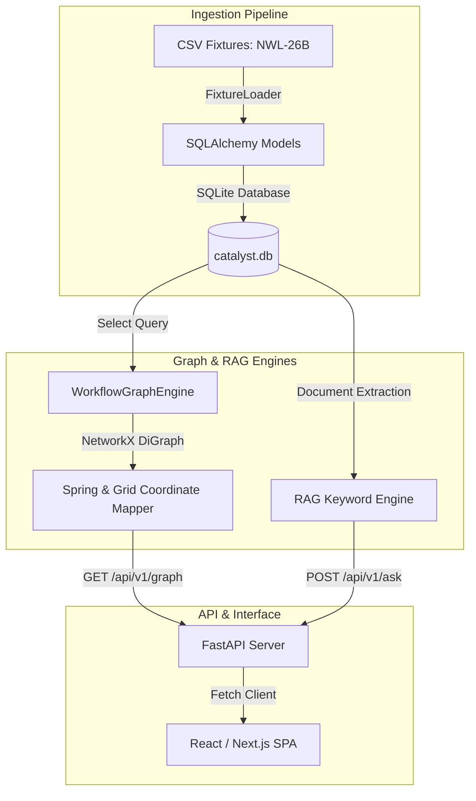

# What Catalyst Is

### The Problem
In enterprise logistics, Oracle OTM and GTM automation rules (called "agents") are defined using opaque, nested XML configuration files. These configurations lack standard visual maps, automated regression testing frameworks, or side-by-side version comparison tools. This opacity makes it impossible for logistics analysts to know if a newly deployed agent will overlap or conflict with existing logic. This vulnerability has become critical with Oracle's release of autonomous AI agents, which execute alongside legacy workflows and create silent, cross-cutting decision overlaps that disrupt shipment execution, carrier selection, and billing.

### What Catalyst Does
Catalyst resolves this opacity by establishing a workflow intelligence and verification safety net. It ingests OTM XML configuration files, parses their relational dependencies, and constructs an in-memory graph model. Using this graph, Catalyst automatically detects trigger conflicts (events where multiple agents compete to fire), visualizes complete execution paths in an interactive swimlane map, isolates configurations in a draft sandbox for live regression testing, shows side-by-side version differences, and lets analysts query system anomalies using grounded chat.

### The Ingestion Pipeline

### Real vs. Simulated Implementations
Catalyst computes its metrics and visualizations using **real backend calculations** on the Northwestern Logistics `NWL-26B` relational seed tables:
- **Real Backend Logic**: Graph layouts, path tracing, regression evaluations, and side-by-side version comparisons run entirely on the Python backend using real SQLite database entries.
- **Simulated OTM Integration**: Out of scope. There is no active connection to a live Oracle OTM cloud server. The data is entirely read from pre-loaded seed fixtures.
- **Synthetic Historic Data**: Because the static seed tables lack real-time operations, Catalyst synthetically preloads historical timelines. This includes the process health schedules (`process_health.json`), transaction audit histories (`audit_logs.json`), and the failing steps of execution run `RUN-48213` (`traces_history.json`). Re-executing this trace evaluates the promoted database config text in real-time, matching the simulated OTM run to the actual configuration state.
